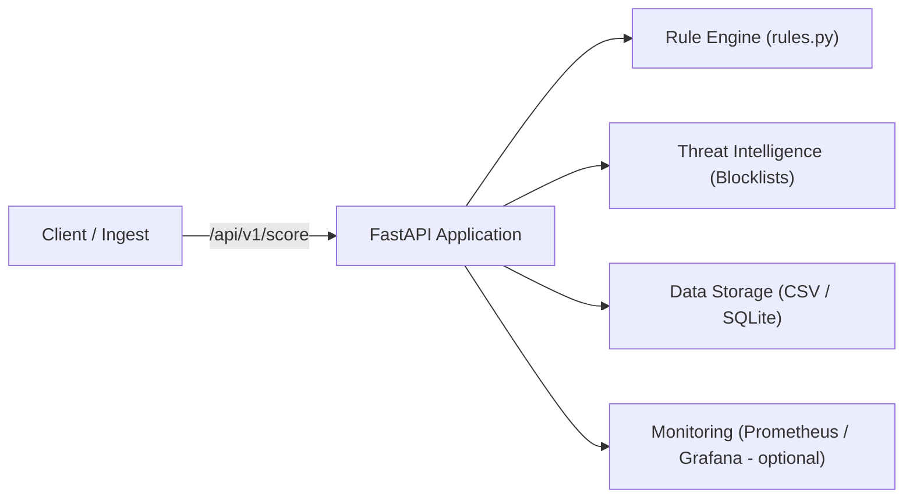

# SecureBank – Financially-Aware Zero-Trust Threat Detection Framework


SecureBank is an open-source cybersecurity research and engineering framework demonstrating a financially-aware zero-trust architecture for banking systems.

This repository serves as **public research evidence**, **open-source contribution**, and a **simulation platform** for academic and industry use.

---

##  Academic Publication (Preprint)

**SecureBank**: A Financially-Aware Zero-Trust Architecture for High-Assurance Banking Systems

- **DOI:** [https://doi.org/10.5281/zenodo.18071268](https://doi.org/10.5281/zenodo.18071268)
- **Version:** v1.0
- **Author:** Paulo Fernandes Biao
- **Indexed in:** OpenAIRE (Zenodo)

This repository contains the **companion implementation and simulation artifacts** supporting the publication.

---

##  Objective

Detect suspicious financial activity and identity abuse in **simulated banking and fintech environments**:

- Real-time risk evaluation via secure APIs
- Explainable scoring with explicit reason codes
- Quantitative validation through Monte Carlo simulation
- Architecture suitable for academic review and expert evaluation

---

##  Key Features

- FastAPI-based secure transaction scoring API
- Rule-based threat detection:
  - Velocity anomalies
  - Geo-IP changes
  - Device mismatches
  - High-risk transaction patterns
  - Threat intelligence blocklists
- Explainable output (score + reasons + flags)
- Batch CSV evaluation for offline analysis
- Reproducible Monte Carlo simulation module
- Dockerized execution environment
- MIT open-source license

---
## 🧪 Scientific Validation

The SecureBank™ framework is supported by a full Monte Carlo–based
statistical validation module, including hypothesis testing,
effect size analysis, and publication-ready visualizations.

See: `sim/securebank-sim/README.md`

---

##  System Architecture



---

##  Quick Start

### Using Docker (recommended)

```bash
docker compose up --build
```

API available at: [http://localhost:8000/docs](http://localhost:8000/docs)

---

### Local Execution (Python 3.10+)

```bash
python -m venv .venv
source .venv/bin/activate
pip install -r requirements.txt
uvicorn securebank.main:app --reload --port 8000
```

---

##   API Example

```bash
curl -X POST http://localhost:8000/api/v1/score -H "Content-Type: application/json" -d '{
  "user_id": "dev001",
  "amount": 999.99,
  "merchant": "ELC",
  "ip": "198.51.100.20",
  "device_id": "dev001"
}'
```
---

##   Response:

```json
{
  "score": 80,
  "reasons": ["High amount", "Suspicious IP range"],
  "flags": { "high_risk": true }
}
```

---

##  Tests

Run tests with:

```bash
pytest -q
```

---

##  Project Structure

```
src/
  securebank/
    main.py
    rules.py
    models.py
    utils.py
tests/
  test_rules.py
data/
  sample_transactions.csv
  threat_intel_blocklist.txt
sim/
  securebank-sim/
docs/
  roadmap.md
.github/workflows/
Dockerfile
docker-compose.yml
requirements.txt
LICENSE
README.md
```

---

##  Simulation Module (Research)

```bash
cd sim/securebank-sim
python runner.py
```

---

##  EB2-NIW Relevance

This project demonstrates:

- **National Importance:** financial system resilience and fraud detection
- **Well Positioned:** secure APIs, detection logic, CI, documentation
- **On Balance:** open-source contribution enabling adoption and reuse

---

##  License

MIT License

---
