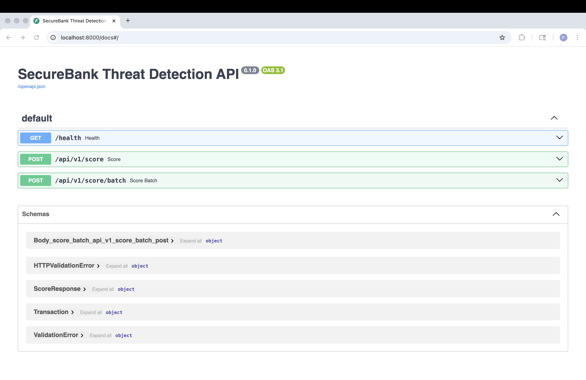

[](https://opensource.org/licenses/MIT)
[](https://www.python.org/)
[](https://fastapi.tiangolo.com/)
[](https://www.docker.com/)
[](#)
[](#)

## 🖼️ API Docs


> **Open-Source Cybersecurity Project by Paulo Bião** — Fintech threat detection system demonstrating secure API, anomaly detection, and compliance-aware design for EB2-NIW portfolio.

# SecureBank™ – Financial Threat Detection System (Open Source)

**Objective:** Detect suspicious financial activity and login abuse in (simulated) fintech/banking environments, with real‑time API alerts and explainable rule‑based scoring.

> This repository is designed as **portfolio‑grade evidence** of cybersecurity expertise for **EB2‑NIW**. It showcases secure coding, log analysis, anomaly detection, and compliance‑aware reporting.

---

## ✨ Features
- FastAPI service to **ingest** transactions and **evaluate risk** in real time
- **Rule‑based detection** (velocity, geo‑IP change, device mismatch, high‑risk MCCs, blacklist hits)
- **Explainable score** with **reason codes** for each alert
- CSV **batch scoring** (offline analysis) + example dashboard (notebook placeholder)
- **Threat intel hooks** (local blocklist file; ready for OTX/VirusTotal integration)
- **Docker** and **GitHub Actions CI** pipeline
- MIT License

---

## 🏗️ Architecture

```mermaid
flowchart LR
A[Client / Ingest] -->|/api/v1/score| B(FastAPI App)
B --> C[rules.py: detectors]
B --> D[threat intel: blocklists]
B --> E[(SQLite / CSV)]
B --> F[Prometheus/Grafana (optional)]
```

- **FastAPI** service exposes `/api/v1/score` (single txn) and `/api/v1/score/batch` (CSV).
- **Rule engine** produces a **risk score (0–100)** and **reason codes**.
- **Data** artifacts in `data/` include a sample transactions CSV and a simple IP/Email blocklist.

---

## 🚀 Quick Start

### Using Docker (recommended)
```bash
docker compose up --build
# API at http://localhost:8000/docs
```

### Local (Python 3.10+)
```bash
python -m venv .venv && source .venv/bin/activate  # (Windows: .venv\Scripts\activate)
pip install -r requirements.txt
uvicorn securebank.main:app --reload --port 8000
```

Open the interactive docs at: `http://localhost:8000/docs`

---

## 📡 API

### `POST /api/v1/score`
- **Body**: JSON `Transaction` (see schema)
- **Response**: `{ score: int, reasons: list[str], flags: dict }`

### `POST /api/v1/score/batch`
- **Form**: upload `file` (CSV)
- **Response**: JSON with per‑row scores + aggregate stats

---

## 🧪 Tests
```bash
pytest -q
```

---

## 📁 Project Layout
```
src/
  securebank/
    main.py        # FastAPI app & endpoints
    rules.py       # risk rules & scoring
    models.py      # Pydantic schemas
    utils.py       # helpers (geo/device, loaders)
  tests/
    test_rules.py  # unit tests for detectors
data/
  sample_transactions.csv
  threat_intel_blocklist.txt
docs/
  roadmap.md
.github/workflows/ci.yml
Dockerfile
docker-compose.yml
requirements.txt
LICENSE
README.md
```

---

## 🔒 Security & Compliance Notes
- Example‑only data; no real PII. 
- Encryption, tokenization, audit logging, and IAM policies are **outlined** in `docs/roadmap.md` for future hardening.
- For EB2‑NIW, cite this repo as **open‑source contribution** to financial cyber defense.

---

## 🧩 EB2‑NIW Mapping (How this supports your petition)
- **National Importance**: strengthens financial system resilience via open, reusable detectors.
- **Well Positioned**: demonstrates your expertise with secure API, detection logic, CI, docs.
- **On Balance**: public, license‑free tool fosters adoption by SMEs/fintechs, supporting U.S. fintech security.

---

## 📌 Next Steps (good for portfolio)
- Add **rate limiting**, **JWT auth**, **audit logs**, and **Prometheus metrics**.
- Integrate **OTX/VirusTotal** and add **time‑series** datastore (Postgres/Timescale).
- Publish a **demo dashboard** (Plotly Dash) and **threat hunting notebook**.
```
---

## 🧠 Example Run

Try a simple example after running the API locally:

```bash
curl -X POST http://localhost:8000/api/v1/score \
  -H "Content-Type: application/json" \
  -d '{
        "user_id": "u001",
        "amount": 999.99,
        "merchant": "ELC",
        "ip": "198.51.100.20",
        "device_id": "dev001"
      }'
{
  "score": 80,
  "reasons": ["High amount", "Electronics purchase", "Known suspicious IP range"],
  "flags": {"high_risk": true}
}
## SecureBank Simulation: TII / SAE / ITAL

The repository includes a simulation module under `sim/securebank-sim/` that:
- Generates synthetic financial transactions (normal + attacks)
- Compares a traditional baseline PDP vs. SecureBank™ PDP
- Computes three quantitative metrics:
  - **Transactional Integrity Index (TII)**
  - **Security Automation Efficiency (SAE)**
  - **Identity Trust Adaptation Level (ITAL)**

To run the simulator:

```bash
cd sim/securebank-sim
python runner.py


